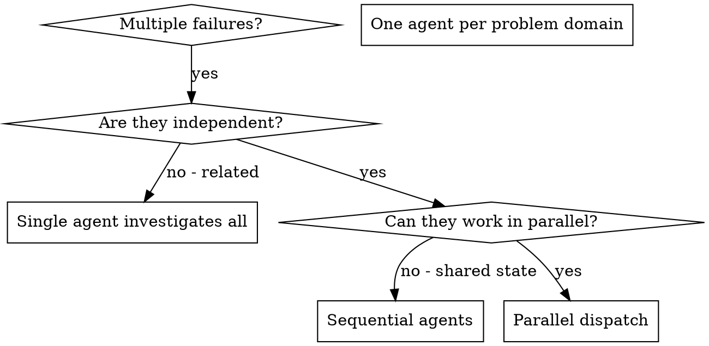

# 並行エージェントのディスパッチ

## 概要

無関係な障害が複数ある場合 (テストファイルが違う、サブシステムが違う、バグが違うなど)、順番に調査するのは時間の無駄。各調査は独立しており並行可能。

**中核原則:** 独立した問題領域ごとに 1 エージェントを割り当て、同時並行で進める。

## 使用タイミング



**使用する場面:**
- 根本原因が異なる 3 つ以上のテストファイルが失敗している
- 複数のサブシステムが独立して壊れている
- 各問題が他の文脈なしに理解できる
- 調査間に共有状態がない

**使用しない場面:**
- 失敗が関連している (1 つ直せば他も直る可能性)
- システム全体の状態理解が必要
- エージェント同士が干渉する

## パターン

### 1. 独立領域の特定

壊れている対象ごとにグルーピング:
- File A tests: Tool approval flow
- File B tests: Batch completion behavior
- File C tests: Abort functionality

各領域は独立している - ツール承認の修正は中断テストに影響しない。

### 2. フォーカスされたエージェントタスクの作成

各エージェントに与えるもの:
- **具体的な範囲:** 1 つのテストファイルまたはサブシステム
- **明確な目標:** これらのテストを通す
- **制約:** 他のコードは変更しない
- **期待アウトプット:** 発見と修正内容の要約

### 3. 並行ディスパッチ

```typescript
// In Claude Code / AI environment
Task("Fix agent-tool-abort.test.ts failures")
Task("Fix batch-completion-behavior.test.ts failures")
Task("Fix tool-approval-race-conditions.test.ts failures")
// All three run concurrently
```

### 4. レビューと統合

エージェントの戻り後:
- 各サマリを読む
- 修正が衝突しないことを確認
- テスト全体を実行
- すべての変更を統合

## エージェントプロンプトの構成

良いエージェントプロンプト:
1. **Focused** - 明確に 1 つの問題領域
2. **Self-contained** - 問題理解に必要な文脈がすべてある
3. **Specific about output** - 返すべき内容が明確

```markdown
Fix the 3 failing tests in src/agents/agent-tool-abort.test.ts:

1. "should abort tool with partial output capture" - expects 'interrupted at' in message
2. "should handle mixed completed and aborted tools" - fast tool aborted instead of completed
3. "should properly track pendingToolCount" - expects 3 results but gets 0

これらはタイミング/レースコンディションの問題です。あなたのタスク:

1. Read the test file and understand what each test verifies
2. Identify root cause - timing issues or actual bugs?
3. Fix by:
   - Replacing arbitrary timeouts with event-based waiting
   - Fixing bugs in abort implementation if found
   - Adjusting test expectations if testing changed behavior

単にタイムアウトを延ばすのではなく、本当の原因を特定してください。

返す内容: 発見と修正内容のサマリ。
```

## よくあるミス

**❌ 広すぎる:** "Fix all the tests" - エージェントが迷う
**✅ 具体的:** "Fix agent-tool-abort.test.ts" - 範囲が明確

**❌ 文脈なし:** "Fix the race condition" - どこか分からない
**✅ 文脈あり:** エラーメッセージとテスト名を貼る

**❌ 制約なし:** エージェントが全部リファクタリングするかもしれない
**✅ 制約あり:** "Do NOT change production code" または "Fix tests only"

**❌ 出力が曖昧:** "Fix it" - 何が変わったか分からない
**✅ 具体的:** "Return summary of root cause and changes"

## 使用しない場面

**関連する失敗:** 1 つ直すと他も直るかもしれない - まず一緒に調査
**全体文脈が必要:** システム全体を見ないと理解できない
**探索的デバッグ:** 何が壊れているか分からない
**共有状態:** エージェントが干渉する (同じファイル編集、同じリソース使用)

## セッションからの実例

**シナリオ:** 大規模リファクタ後、3 ファイルで 6 件のテスト失敗

**失敗:**
- agent-tool-abort.test.ts: 3 failures (timing issues)
- batch-completion-behavior.test.ts: 2 failures (tools not executing)
- tool-approval-race-conditions.test.ts: 1 failure (execution count = 0)

**判断:** 独立領域 - 中断ロジック、バッチ完了、レースコンディションは別

**ディスパッチ:**
```
Agent 1 → Fix agent-tool-abort.test.ts
Agent 2 → Fix batch-completion-behavior.test.ts
Agent 3 → Fix tool-approval-race-conditions.test.ts
```

**結果:**
- Agent 1: タイムアウトをイベントベース待機に置換
- Agent 2: イベント構造のバグを修正 (threadId の位置)
- Agent 3: 非同期ツール実行完了の待機を追加

**統合:** すべて独立した修正で競合なし、テスト全体がグリーン

**節約時間:** 逐次ではなく並行で 3 問題を解決

## 主要な利点

1. **並列化** - 複数の調査が同時進行
2. **集中** - 各エージェントの範囲が狭く、追う文脈が少ない
3. **独立性** - エージェント同士が干渉しない
4. **速度** - 1 件分の時間で 3 問題を解決

## 検証

エージェントの戻り後:
1. **各サマリをレビュー** - 何が変わったか理解する
2. **競合の確認** - 同じコードを編集していないか
3. **テスト全体を実行** - すべての修正が連携するか確認
4. **スポットチェック** - エージェントの系統的な誤りに備える

## 実地での効果

デバッグセッションより (2025-10-03):
- 3 ファイルで 6 件の失敗
- 3 エージェントを並行ディスパッチ
- すべての調査が同時に完了
- すべての修正を統合成功
- エージェント変更の競合はゼロ
