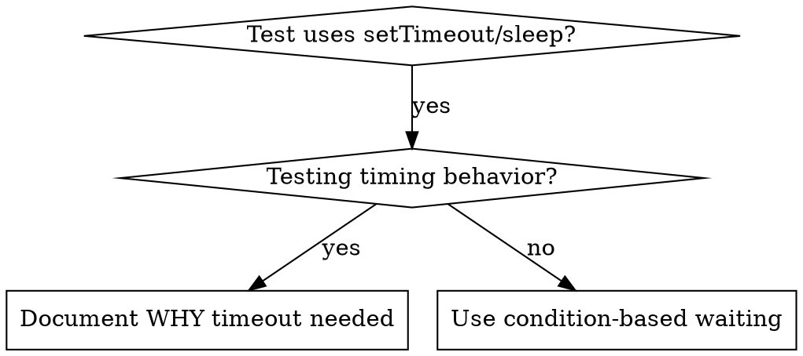

# 条件ベース待機

## 概要

フレイキーなテストは、任意の遅延でタイミングを推測しがちだ。これにより、速いマシンでは通るが、負荷や CI では落ちるレースが生まれる。

**中核原則:** 所要時間の推測ではなく、実際に必要な条件を待つ。

## 使うべき場面



**使うべき状況:**
- テストに任意の遅延がある (`setTimeout`, `sleep`, `time.sleep()`) 
- テストがフレイキー（通る時と落ちる時がある）
- 並列実行でタイムアウトする
- 非同期処理の完了を待っている

**使わない場面:**
- 実際のタイミング挙動をテストする場合（デバウンス、スロットルなど）
- 任意のタイムアウトを使うなら理由を必ず記録する

## 中核パターン

```typescript
// ❌ BEFORE: タイミングを推測
await new Promise(r => setTimeout(r, 50));
const result = getResult();
expect(result).toBeDefined();

// ✅ AFTER: 条件を待つ
await waitFor(() => getResult() !== undefined);
const result = getResult();
expect(result).toBeDefined();
```

## クイックパターン

| シナリオ | パターン |
|----------|---------|
| イベントを待つ | `waitFor(() => events.find(e => e.type === 'DONE'))` |
| 状態を待つ | `waitFor(() => machine.state === 'ready')` |
| 件数を待つ | `waitFor(() => items.length >= 5)` |
| ファイルを待つ | `waitFor(() => fs.existsSync(path))` |
| 複雑条件 | `waitFor(() => obj.ready && obj.value > 10)` |

## 実装

汎用ポーリング関数:
```typescript
async function waitFor<T>(
  condition: () => T | undefined | null | false,
  description: string,
  timeoutMs = 5000
): Promise<T> {
  const startTime = Date.now();

  while (true) {
    const result = condition();
    if (result) return result;

    if (Date.now() - startTime > timeoutMs) {
      throw new Error(`Timeout waiting for ${description} after ${timeoutMs}ms`);
    }

    await new Promise(r => setTimeout(r, 10)); // 10msごとにポーリング
  }
}
```

このディレクトリの `condition-based-waiting-example.ts` に、実デバッグセッション由来のドメイン専用ヘルパー（`waitForEvent`, `waitForEventCount`, `waitForEventMatch`）を含む完全実装がある。

## よくあるミス

**❌ ポーリングが速すぎる:** `setTimeout(check, 1)` - CPU を無駄に消費
**✅ 修正:** 10ms ごとにポーリング

**❌ タイムアウトなし:** 条件が満たされないと無限ループ
**✅ 修正:** 明確なエラー付きタイムアウトを必ず入れる

**❌ 古いデータ:** ループ前に状態をキャッシュ
**✅ 修正:** ループ内で getter を呼び最新化

## 任意のタイムアウトが正しい場合

```typescript
// Tool ticks every 100ms - need 2 ticks to verify partial output
await waitForEvent(manager, 'TOOL_STARTED'); // First: wait for condition
await new Promise(r => setTimeout(r, 200));   // Then: wait for timed behavior
// 200ms = 2 ticks at 100ms intervals - documented and justified
```

**要件:**
1. まずトリガー条件を待つ
2. 既知のタイミングに基づく（推測しない）
3. なぜ必要かをコメントで説明する

## 実運用での効果

デバッグセッション（2025-10-03）より:
- 3ファイルで15件のフレイキーを修正
- 成功率: 60% → 100%
- 実行時間: 40%短縮
- レースコンディションが消滅
