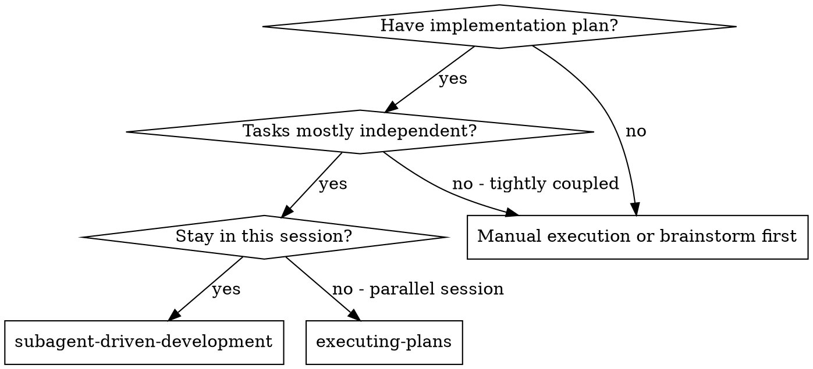
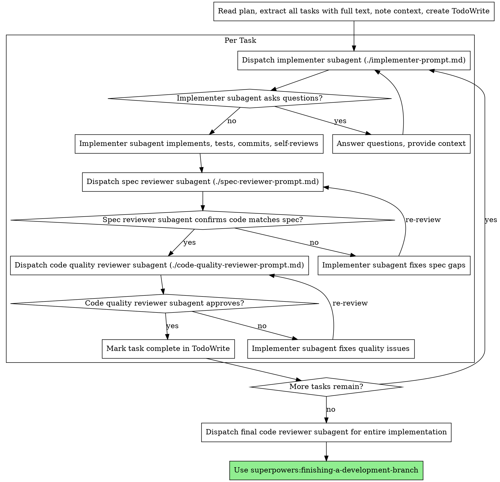

# サブエージェント駆動開発

タスクごとに新しいサブエージェントを割り当てて計画を実行し、各タスク後に二段階レビューを行う: まず仕様適合レビュー、次にコード品質レビュー。

**中核原則:** タスクごとの新鮮なサブエージェント + 二段階レビュー (仕様→品質) = 高品質・高速反復

## 使用タイミング



**Executing Plans (並行セッション) との違い:**
- 同一セッション (コンテキスト切替なし)
- タスクごとに新しいサブエージェント (コンテキスト汚染なし)
- 各タスク後に二段階レビュー: 仕様適合→コード品質
- 高速反復 (タスク間に人間のループ不要)

## プロセス



## プロンプトテンプレート

- `./implementer-prompt.md` - 実装担当サブエージェントをディスパッチ
- `./spec-reviewer-prompt.md` - 仕様適合レビューサブエージェントをディスパッチ
- `./code-quality-reviewer-prompt.md` - コード品質レビューサブエージェントをディスパッチ

## ワークフロー例

```
You: Subagent-Driven Development を使ってこの計画を実行します。

[計画ファイルを 1 回読む: docs/plans/feature-plan.md]
[5 つのタスクを全文と文脈付きで抽出]
[全タスクで TodoWrite を作成]

タスク 1: フック導入スクリプト

[タスク 1 の本文と文脈を取得 (抽出済み)]
[タスク全文 + 文脈で実装サブエージェントをディスパッチ]

Implementer: "Before I begin - should the hook be installed at user or system level?"

You: "User level (~/.config/superpowers/hooks/)"

Implementer: "Got it. Implementing now..."
[Later] Implementer:
  - Implemented install-hook command
  - Added tests, 5/5 passing
  - Self-review: Found I missed --force flag, added it
  - Committed

[仕様適合レビューをディスパッチ]
Spec reviewer: ✅ Spec compliant - all requirements met, nothing extra

[git SHA を取得し、コード品質レビューをディスパッチ]
Code reviewer: Strengths: Good test coverage, clean. Issues: None. Approved.

[タスク 1 を完了にする]

タスク 2: リカバリーモード

[タスク 2 の本文と文脈を取得 (抽出済み)]
[タスク全文 + 文脈で実装サブエージェントをディスパッチ]

Implementer: [No questions, proceeds]
Implementer:
  - Added verify/repair modes
  - 8/8 tests passing
  - Self-review: All good
  - Committed

[仕様適合レビューをディスパッチ]
Spec reviewer: ❌ Issues:
  - Missing: Progress reporting (spec says "report every 100 items")
  - Extra: Added --json flag (not requested)

[実装者が問題を修正]
Implementer: Removed --json flag, added progress reporting

[仕様レビュアーが再レビュー]
Spec reviewer: ✅ Spec compliant now

[コード品質レビューをディスパッチ]
Code reviewer: Strengths: Solid. Issues (Important): Magic number (100)

[実装者が修正]
Implementer: Extracted PROGRESS_INTERVAL constant

[コードレビュアーが再レビュー]
Code reviewer: ✅ Approved

[タスク 2 を完了にする]

...

[全タスク完了後]
[最終コードレビュアーをディスパッチ]
Final reviewer: All requirements met, ready to merge

完了!
```

## 利点

**手動実行との比較:**
- サブエージェントは自然に TDD に従う
- タスクごとの新鮮な文脈 (混乱なし)
- 並行安全 (サブエージェント同士が干渉しない)
- サブエージェントが質問できる (作業前 AND 作業中)

**Executing Plans との比較:**
- 同一セッション (引き渡しなし)
- 継続的な進行 (待ちなし)
- レビューチェックポイントが自動

**効率向上:**
- ファイル読み込みオーバーヘッドなし (コントローラが全文提供)
- コントローラが必要な文脈を厳選
- サブエージェントは最初から完全情報を受け取る
- 質問は作業開始前に顕在化 (後ではない)

**品質ゲート:**
- セルフレビューで引き渡し前に問題を検知
- 二段階レビュー: 仕様適合→コード品質
- レビューループで修正が実際に効くことを保証
- 仕様適合で過剰/不足な実装を防止
- コード品質で実装の作り込みを保証

**コスト:**
- サブエージェント呼び出し回数増 (実装者 + 2 レビュアー/タスク)
- コントローラの準備作業が増える (全タスクの事前抽出)
- レビューループで反復が増える
- ただし問題を早期発見 (後のデバッグより安い)

## レッドフラグ

**絶対にしない:**
- レビューを省略 (仕様適合 OR コード品質)
- 未修正の問題があるまま進める
- 複数の実装サブエージェントを並行ディスパッチ (競合)
- サブエージェントに計画ファイルを読ませる (全文を渡す)
- シーン設定の文脈を省略 (タスクの位置づけが必要)
- サブエージェントの質問を無視 (回答してから進める)
- 仕様適合で「だいたい OK」を許容 (問題が見つかったら未完了)
- レビューループを省略 (レビューで問題→実装修正→再レビュー)
- 実装者のセルフレビューで本レビューを代替しない (両方必要)
- **仕様適合が ✅ になる前にコード品質レビューを開始しない** (順序違い)
- どちらかのレビューが未解決のまま次タスクへ進まない

**サブエージェントが質問した場合:**
- 明確かつ完全に回答する
- 必要なら追加の文脈を提供
- 実装を急がせない

**レビュアーが問題を見つけた場合:**
- 実装者 (同一サブエージェント) が修正
- レビュアーが再レビュー
- 承認されるまで繰り返す
- 再レビューを省略しない

**サブエージェントがタスクに失敗した場合:**
- 修正サブエージェントを具体的指示でディスパッチ
- 手動で直そうとしない (コンテキスト汚染)

## 連携

**必須ワークフロー skills:**
- **superpowers:writing-plans** - この skill が実行する計画を作成
- **superpowers:requesting-code-review** - レビュアー用テンプレート
- **superpowers:finishing-a-development-branch** - 全タスク後の開発完了

**サブエージェントが使うべき skill:**
- **superpowers:test-driven-development** - 各タスクで TDD に従う

**代替ワークフロー:**
- **superpowers:executing-plans** - 同一セッションではなく並行セッションで使用
