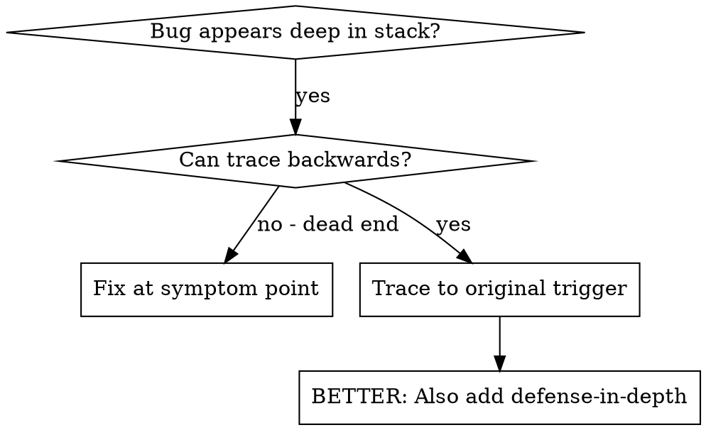
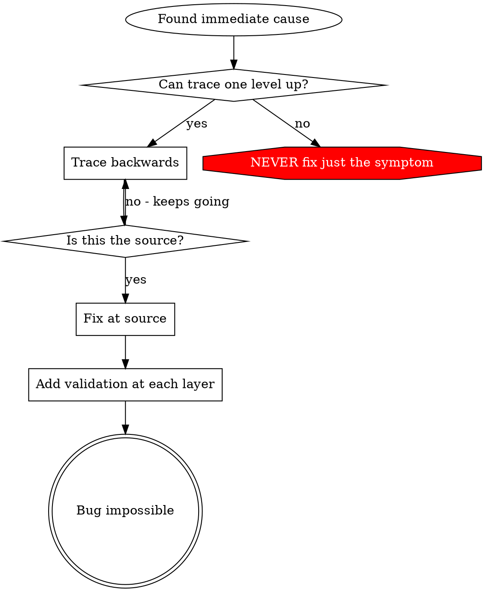

# 根本原因トレース

## 概要

バグはコールスタックの深い場所で表面化することが多い（誤ったディレクトリで `git init`、誤った場所にファイル作成、誤ったパスでDBを開くなど）。直感的にはエラーが出た場所を直したくなるが、それは症状の治療にすぎない。

**中核原則:** 呼び出しチェーンを逆向きに辿って元のトリガーを見つけ、発生源で修正する。

## 使うべき場面



**使うべき状況:**
- エラーが実行の深い位置で起きている（入口ではない）
- スタックトレースが長い呼び出しチェーンを示している
- 無効なデータの起点が不明
- どのテスト/コードが問題を引き起こすかを特定したい

## トレース手順

### 1. 症状を観測する
```
Error: git init failed in /Users/jesse/project/packages/core
```

### 2. 直近の原因を見つける
**このエラーを直接起こしているコードは？**
```typescript
await execFileAsync('git', ['init'], { cwd: projectDir });
```

### 3. 「これを呼んだのは誰か？」を辿る
```typescript
WorktreeManager.createSessionWorktree(projectDir, sessionId)
  → called by Session.initializeWorkspace()
  → called by Session.create()
  → called by test at Project.create()
```

### 4. さらに上流へ辿る
**渡された値は何か？**
- `projectDir = ''`（空文字）
- 空文字の `cwd` は `process.cwd()` に解決される
- つまりソースコードディレクトリを指している

### 5. 元のトリガーを見つける
**空文字はどこから来たのか？**
```typescript
const context = setupCoreTest(); // Returns { tempDir: '' }
Project.create('name', context.tempDir); // Accessed before beforeEach!
```

## スタックトレースの追加

手作業で辿れないなら計測を追加する:

```typescript
// Before the problematic operation
async function gitInit(directory: string) {
  const stack = new Error().stack;
  console.error('DEBUG git init:', {
    directory,
    cwd: process.cwd(),
    nodeEnv: process.env.NODE_ENV,
    stack,
  });

  await execFileAsync('git', ['init'], { cwd: directory });
}
```

**重要:** テストでは `console.error()` を使う（logger だと表示されない場合がある）

**実行して収集:**
```bash
npm test 2>&1 | grep 'DEBUG git init'
```

**スタックトレースの分析:**
- テストファイル名を探す
- 呼び出し元の行番号を見つける
- パターンを特定する（同じテスト？同じパラメータ？）

## どのテストが汚染しているかを特定する

テスト中に何かが起きるが、どのテストかわからない場合:

このディレクトリの二分探索スクリプト `find-polluter.sh` を使う:

```bash
./find-polluter.sh '.git' 'src/**/*.test.ts'
```

テストを1つずつ実行し、最初の汚染者で停止する。使い方はスクリプト参照。

## 実例: 空の projectDir

**症状:** `.git` が `packages/core/`（ソースコード）に作られる

**トレースチェーン:**
1. `git init` が `process.cwd()` で実行される ← 空の cwd パラメータ
2. WorktreeManager が空の projectDir で呼ばれる
3. Session.create() に空文字が渡る
4. テストが beforeEach の前に `context.tempDir` を参照
5. setupCoreTest() が初期値として `{ tempDir: '' }` を返す

**根本原因:** トップレベル変数初期化が空値にアクセスしていた

**修正:** beforeEach 前に参照すると例外を投げる getter に変更

**加えた防御層:**
- Layer 1: Project.create() でディレクトリを検証
- Layer 2: WorkspaceManager で空でないことを検証
- Layer 3: NODE_ENV ガードで tmpdir 以外の git init を拒否
- Layer 4: git init 前にスタックトレースをログ

## 原則



**エラーが出た場所だけを直してはいけない。** 元のトリガーまで遡る。

## スタックトレースのコツ

**テストでは:** `console.error()` を使う（logger は抑制されることがある）
**操作の前に:** 危険な操作の前にログする。失敗後では遅い。
**コンテキストを含める:** ディレクトリ、cwd、環境変数、タイムスタンプ
**スタックを収集:** `new Error().stack` で呼び出しチェーンを取得

## 実運用での効果

デバッグセッション（2025-10-03）より:
- 5階層のトレースで根本原因を特定
- 発生源で修正（getter 検証）
- 4層の防御を追加
- 1847テストが通過、汚染ゼロ
