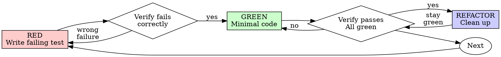

# テスト駆動開発 (TDD)

## 概要

テストを先に書く。失敗を確認する。最小のコードで通す。

**中核原則:** テストが失敗するのを見ていないなら、そのテストが正しい対象を検証しているか分からない。

**規則の文字を破ることは、規則の精神を破ることと同義。**

## 使うべき場面

**常に:**
- 新機能
- バグ修正
- リファクタリング
- 振る舞いの変更

**例外（人間のパートナーに相談）:**
- 使い捨てプロトタイプ
- 生成コード
- 設定ファイル

「今回だけ TDD を飛ばす？」と考えたら停止。それは合理化。

## 鉄則

```
NO PRODUCTION CODE WITHOUT A FAILING TEST FIRST
```

テストより先にコードを書いたら削除して最初からやり直す。

**例外なし:**
- 「参考として残す」はダメ
- テストを書きながら「適応」するのもダメ
- 見ない
- 削除は削除

テストから新規実装する。以上。

## Red-Green-Refactor



### RED - 失敗するテストを書く

起きるべきことを示す最小テストを1つ書く。

<Good>
```typescript
test('retries failed operations 3 times', async () => {
  let attempts = 0;
  const operation = () => {
    attempts++;
    if (attempts < 3) throw new Error('fail');
    return 'success';
  };

  const result = await retryOperation(operation);

  expect(result).toBe('success');
  expect(attempts).toBe(3);
});
```
名前が明確、実際の挙動をテスト、1つのこと
</Good>

<Bad>
```typescript
test('retry works', async () => {
  const mock = jest.fn()
    .mockRejectedValueOnce(new Error())
    .mockRejectedValueOnce(new Error())
    .mockResolvedValueOnce('success');
  await retryOperation(mock);
  expect(mock).toHaveBeenCalledTimes(3);
});
```
名前が曖昧、コードではなくモックをテスト
</Bad>

**要件:**
- 1つの挙動
- 明確な名前
- 実コード（不可避でない限りモックは使わない）

### Verify RED - 失敗を確認する

**必須。絶対に省略しない。**

```bash
npm test path/to/test.test.ts
```

確認事項:
- テストが失敗している（エラーではない）
- 失敗メッセージが期待通り
- 機能不足で失敗している（タイポではない）

**テストが通る？** 既存挙動をテストしている。テストを直す。

**テストがエラー？** エラーを直し、正しく失敗するまで再実行。

### GREEN - 最小コード

テストを通すための最小コードを書く。

<Good>
```typescript
async function retryOperation<T>(fn: () => Promise<T>): Promise<T> {
  for (let i = 0; i < 3; i++) {
    try {
      return await fn();
    } catch (e) {
      if (i === 2) throw e;
    }
  }
  throw new Error('unreachable');
}
```
必要最低限
</Good>

<Bad>
```typescript
async function retryOperation<T>(
  fn: () => Promise<T>,
  options?: {
    maxRetries?: number;
    backoff?: 'linear' | 'exponential';
    onRetry?: (attempt: number) => void;
  }
): Promise<T> {
  // YAGNI
}
```
過剰設計
</Bad>

テスト外の機能追加、他コードのリファクタ、改善はしない。

### Verify GREEN - 通過を確認する

**必須。**

```bash
npm test path/to/test.test.ts
```

確認事項:
- テストが通る
- 他のテストも通る
- 出力がクリーン（エラー/警告なし）

**テストが失敗？** テストではなくコードを直す。

**他のテストが失敗？** すぐに直す。

### REFACTOR - 整理

グリーン後のみ:
- 重複の削除
- 名前の改善
- ヘルパー抽出

テストはグリーンを維持。挙動を追加しない。

### 反復

次の機能のための失敗テストへ。

## 良いテスト

| 品質 | 良い | 悪い |
|---------|------|-----|
| **最小** | 1つだけ。「and」が名前に入るなら分割。 | `test('validates email and domain and whitespace')` |
| **明確** | 挙動を表す名前 | `test('test1')` |
| **意図が見える** | 望ましい API を示す | 何をすべきかが見えない |

## なぜ順序が重要か

**「後でテストを書いて動作確認する」**

コードの後に書いたテストは即座に通る。即合格は何も証明しない:
- 間違った対象をテストしているかもしれない
- 挙動ではなく実装をテストしているかもしれない
- 忘れていた境界ケースを取りこぼす
- バグを捕まえる場面を見られない

テスト先行は失敗を見ることを強制し、実際に何かを検証していることを証明する。

**「手動で境界ケースは全部試した」**

手動テストは場当たり的。全部試したつもりでも:
- 何を試したかの記録がない
- 変更時に再実行できない
- プレッシャー下で忘れやすい
- 「自分で試して動いた」≠ 包括的

自動テストは体系的で、毎回同じように実行される。

**「X時間の作業を消すのはもったいない」**

サンクコストの罠。時間はすでに消えている。今の選択は:
- 削除して TDD で書き直す（X時間追加、高い確信）
- 残して後からテスト（30分、低い確信、バグ混入の可能性）

「無駄」とは、信頼できないコードを残すこと。実テストなしの動くコードは技術的負債。

**「TDD は教条的で、実用的に適応するべき」**

TDD は実用的:
- コミット前にバグを発見（本番デバッグより速い）
- リグレッション防止（テストがすぐに破綻を検知）
- 振る舞いの記録（テストが使い方を示す）
- リファクタしやすい（自由に変更でき、テストが破綻を検知）

「実用的な近道」= 本番デバッグ = もっと遅い。

**「後からテストでも目的は同じ。儀式ではなく精神だ」**

違う。後テストは「これは何をするか？」に答える。先テストは「これは何をすべきか？」に答える。

後テストは実装に引きずられる。必要な挙動ではなく、書いたものをテストする。思い出した境界ケースしか検証できない。

先テストは実装前に境界ケースを発見させる。後テストは「全部覚えていたか」を検証する（覚えていない）。

30分の後テスト ≠ TDD。カバレッジは得るが、テストが機能する証明を失う。

## よくある正当化

| 言い訳 | 現実 |
|--------|---------|
| 「簡単すぎてテスト不要」 | 簡単なコードでも壊れる。テストは30秒。 |
| 「後でテストする」 | 即合格は何も証明しない。 |
| 「後テストでも同じ目的」 | 後テスト = 「何をするか？」先テスト = 「何をすべきか？」 |
| 「手動で十分試した」 | 場当たり ≠ 体系的。記録なし、再実行不可。 |
| 「X時間の作業を消すのはもったいない」 | サンクコスト。未検証コードを残すのは負債。 |
| 「参考に残してテストを書く」 | 必ず適応してしまう。削除は削除。 |
| 「探索が必要」 | いい。探索は捨てて TDD で開始。 |
| 「テストが難しい = 設計が不明」 | テストに従え。テストが難しい = 使いづらい。 |
| 「TDD は遅い」 | TDD はデバッグより速い。実用的 = 先テスト。 |
| 「手動テストの方が速い」 | 手動では境界ケースを証明できない。変更のたびに再テスト。 |
| 「既存コードにテストがない」 | 改善中だ。既存コードにもテストを足す。 |

## レッドフラグ - STOP して最初から

- テスト前にコード
- 実装後にテスト
- テストが即通る
- なぜテストが落ちたか説明できない
- 「後で」テストを追加
- 「今回だけ」と合理化
- 「手動でテストした」
- 「後テストでも同じ」
- 「精神であって儀式ではない」
- 「参考に残す」「既存コードを適応する」
- 「X時間使ったから削除は無駄」
- 「TDD は教条的、実用的にやる」
- 「これは例外だから...」

**これらはすべて: コードを削除。TDD でやり直し。**

## 例: バグ修正

**バグ:** 空メールが受理される

**RED**
```typescript
test('rejects empty email', async () => {
  const result = await submitForm({ email: '' });
  expect(result.error).toBe('Email required');
});
```

**Verify RED**
```bash
$ npm test
FAIL: expected 'Email required', got undefined
```

**GREEN**
```typescript
function submitForm(data: FormData) {
  if (!data.email?.trim()) {
    return { error: 'Email required' };
  }
  // ...
}
```

**Verify GREEN**
```bash
$ npm test
PASS
```

**REFACTOR**
必要なら複数フィールドの検証を抽出。

## 検証チェックリスト

完了宣言の前に:

- [ ] すべての新規関数/メソッドにテストがある
- [ ] 実装前に各テストの失敗を確認した
- [ ] テストは期待通りの理由で失敗した（機能不足、タイポではない）
- [ ] 各テストを通す最小コードを書いた
- [ ] すべてのテストが通った
- [ ] 出力がクリーン（エラー/警告なし）
- [ ] テストは実コードを使っている（不可避の場合のみモック）
- [ ] 境界ケースとエラーをカバーした

すべてにチェックできないなら TDD をスキップしている。最初からやり直す。

## 行き詰まったとき

| 問題 | 解決策 |
|---------|----------|
| どうテストすればいいか分からない | 望ましい API を書く。先にアサーションを書く。人間のパートナーに聞く。 |
| テストが複雑すぎる | 設計が複雑すぎる。インターフェースを簡素化する。 |
| モックだらけになる | 結合が強すぎる。依存性注入を使う。 |
| テスト準備が巨大 | ヘルパーを抽出。それでも複雑なら設計を簡素化。 |

## デバッグとの統合

バグを発見したら、それを再現する失敗テストを書く。TDD サイクルに従う。テストが修正を証明し、リグレッションを防ぐ。

テストなしでバグを直してはいけない。

## テストのアンチパターン

モックやテストユーティリティを追加する場合は @testing-anti-patterns.md を読み、次の落とし穴を避ける:
- 実挙動ではなくモック挙動をテストする
- 本番クラスにテスト専用メソッドを追加する
- 依存関係の理解なしにモックする

## 最終ルール

```
Production code → test exists and failed first
Otherwise → not TDD
```

人間のパートナーの許可なしに例外はない。
