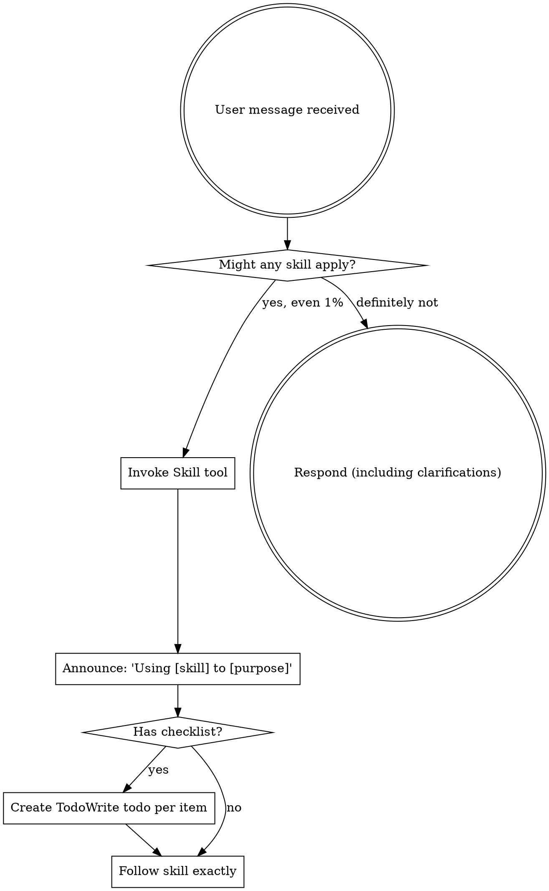

<EXTREMELY-IMPORTANT>
行っていることに skill が該当する可能性が 1% でもあるなら、必ずその skill を呼び出すこと。

あなたのタスクに skill が該当するなら、選択肢はない。必ず使用すること。

これは交渉不可。任意ではない。正当化して回避することはできない。
</EXTREMELY-IMPORTANT>

## Skills へのアクセス方法

**Claude Code の場合:** `Skill` ツールを使う。skill を呼び出すと内容が読み込まれて提示されるので、それに直接従う。skill ファイルに Read ツールを使わない。

**その他の環境:** skills の読み込み方法はプラットフォームのドキュメントを確認する。

# Skills の利用

## ルール

**関連または要求された skills は、どんな応答や行動の前にも呼び出すこと。** 1% でも該当する可能性があるなら呼び出して確認する。呼び出した skill が状況に合わないと分かった場合は使わなくてよい。

## レッドフラグ

次の思考が出たら停止 - 正当化している:

| 思考 | 現実 |
|---------|---------|
| "This is just a simple question" | 質問はタスク。skills を確認する。 |
| "I need more context first" | skill の確認は質問より前。 |
| "Let me explore the codebase first" | skills が探索方法を示す。まず確認。 |
| "I can check git/files quickly" | ファイルには会話文脈がない。skills を確認する。 |
| "Let me gather information first" | skills が情報収集の方法を示す。 |
| "This doesn't need a formal skill" | skill があるなら使う。 |
| "I remember this skill" | skills は更新される。現行を読む。 |
| "This doesn't count as a task" | 行動 = タスク。skills を確認する。 |
| "The skill is overkill" | 簡単なことが複雑化する。使う。 |
| "I'll just do this one thing first" | 何かする前に確認。 |
| "This feels productive" | 規律のない行動は時間の無駄。skills が防ぐ。 |
| "I know what that means" | 概念を知っている ≠ skill を使う。呼び出す。 |

## Skill の優先順位

複数の skills が該当する場合は次の順序で使用する:

1. **プロセス系 skill を優先** (brainstorming, debugging) - 取り組み方を決める
2. **実装系 skill を次に** (frontend-design, mcp-builder) - 実行を導く

"Let's build X" → まず brainstorming、その後に実装系 skills。
"Fix this bug" → まず debugging、その後にドメイン固有 skills。

## Skill の種類

**Rigid** (TDD, debugging): 正確に従う。規律を崩さない。

**Flexible** (patterns): 原則を文脈に合わせて調整する。

どちらかは skill 自体が示す。

## ユーザー指示

指示は WHAT を示すのであって HOW ではない。「X を追加」「Y を修正」はワークフローを省略する意味ではない。
