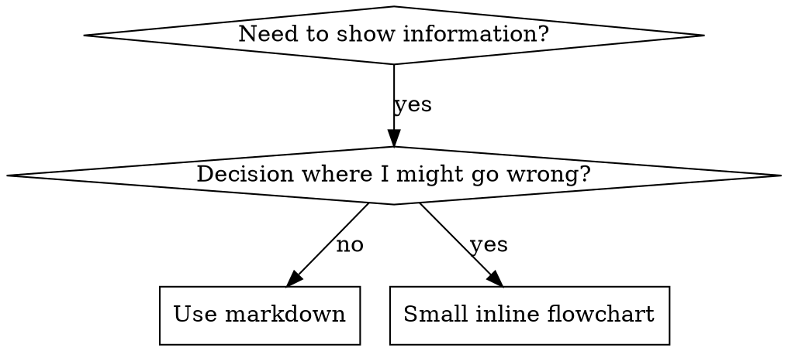

# スキルの書き方

## 概要

**スキル作成は、プロセス文書に適用したテスト駆動開発である。**

**個人スキルはエージェント固有のディレクトリに置く（Claude Code は `~/.claude/skills`、Codex は `~/.codex/skills`）**

テストケース（サブエージェント付きプレッシャーシナリオ）を書き、失敗を観察し（ベースライン挙動）、スキル（ドキュメント）を書き、テストが通るのを確認し（エージェントが遵守）、リファクタして穴を塞ぐ。

**中核原則:** スキルなしでエージェントが失敗するのを見ていないなら、そのスキルが正しいことを教えているか分からない。

**必須の前提:** このスキルを使う前に superpowers:test-driven-development を理解している必要がある。そこに RED-GREEN-REFACTOR の基本サイクルが定義されている。このスキルは TDD をドキュメントに適用する。

**公式ガイダンス:** Anthropic の公式スキル執筆ベストプラクティスは anthropic-best-practices.md を参照。このドキュメントは TDD 中心の本スキルを補完する。

## スキルとは？

**スキル**は、実証済みの技法・パターン・ツールの参照ガイドである。将来の Claude が有効なアプローチを見つけて適用できるようにする。

**スキルであるもの:** 再利用可能な技法、パターン、ツール、リファレンス

**スキルではないもの:** 一度限りの解決の記録

## スキルにおける TDD 対応表

| TDD 概念 | スキル作成 |
|-------------|----------------|
| **テストケース** | サブエージェント付きプレッシャーシナリオ |
| **本番コード** | スキル文書（SKILL.md） |
| **テスト失敗 (RED)** | スキルなしだとルール違反（ベースライン） |
| **テスト成功 (GREEN)** | スキルがあると遵守 |
| **リファクタ** | 遵守を保ったまま穴を塞ぐ |
| **テスト先行** | スキルを書く前にベースラインを実行 |
| **失敗を観測** | エージェントの合理化を正確に記録 |
| **最小コード** | その違反に対処する最小のスキルを書く |
| **成功を確認** | エージェントが遵守するか検証 |
| **リファクタサイクル** | 新しい合理化を見つける → 塞ぐ → 再検証 |

スキル作成全体が RED-GREEN-REFACTOR に従う。

## スキルを作るべき時

**作るべき:**
- 技法が直感的ではなかった
- 複数プロジェクトで再利用したい
- パターンが広く適用できる（プロジェクト限定ではない）
- 他者の役に立つ

**作らない:**
- 一度きりの解決
- 他所に十分なドキュメントがある標準手法
- プロジェクト固有の規約（CLAUDE.md に書く）
- 機械的制約（正規表現/検証で強制できるなら自動化し、判断が必要な部分だけをドキュメント化）

## スキルの種類

### 技法（Technique）
手順を持つ具体的な方法（condition-based-waiting, root-cause-tracing）

### パターン（Pattern）
問題の捉え方（flatten-with-flags, test-invariants）

### リファレンス（Reference）
API ドキュメント、構文ガイド、ツール文書（office docs）

## ディレクトリ構成


```
skills/
  skill-name/
    SKILL.md              # メインリファレンス（必須）
    supporting-file.*     # 必要な場合のみ
```

**フラット名前空間** - すべてのスキルが検索可能な単一空間に入る

**別ファイルに分けるもの:**
1. **重いリファレンス**（100行以上）- API docs, 包括的な構文
2. **再利用ツール** - スクリプト、ユーティリティ、テンプレート

**本文に含めるもの:**
- 原則と概念
- コードパターン（50行未満）
- それ以外すべて

## SKILL.md の構成

**フロントマター（YAML）:**
- 使えるフィールドは `name` と `description` の2つのみ
- 合計 1024 文字以内
- `name`: 英数字とハイフンのみ（括弧・記号は不可）
- `description`: 三人称で、「いつ使うか」だけを書く（何をするかは書かない）
  - 「Use when...」で始めてトリガ条件に集中させる
  - 具体的な症状・状況・文脈を含める
  - **スキルの手順やワークフローを絶対に要約しない**（CSO セクション参照）
  - 可能なら 500 文字以内

```markdown
---
name: Skill-Name-With-Hyphens
description: Use when [specific triggering conditions and symptoms]
---

# Skill Name

## Overview
What is this? Core principle in 1-2 sentences.

## When to Use
[Small inline flowchart IF decision non-obvious]

Bullet list with SYMPTOMS and use cases
When NOT to use

## Core Pattern (for techniques/patterns)
Before/after code comparison

## Quick Reference
Table or bullets for scanning common operations

## Implementation
Inline code for simple patterns
Link to file for heavy reference or reusable tools

## Common Mistakes
What goes wrong + fixes

## Real-World Impact (optional)
Concrete results
```


## Claude Search Optimization (CSO)

**発見性の要:** 将来の Claude がスキルを見つけられる必要がある

### 1. 充実した Description フィールド

**目的:** Claude は description を読んで、どのスキルをロードするか判断する。これが「今このスキルを読むべきか？」に答える必要がある。

**形式:** 「Use when...」で始め、トリガ条件に集中する

**重要: Description = 使うべき条件。スキルの手順ではない**

description は「トリガ条件」だけを書く。スキルの手順/ワークフローを要約してはいけない。

**なぜ重要か:** テスト結果として、description がワークフローを要約すると Claude は本文を読まず description に従いがちになる。例えば「タスク間にコードレビューを挟む」と書くと、スキル本文で「2段階レビュー（仕様 → 品質）」を示していても、Claude はレビュー1回で終える。

description を「Use when executing implementation plans with independent tasks」とだけ書く（ワークフロー要約なし）と、Claude はフローチャートを読んで2段階レビューを実行できた。

**罠:** ワークフロー要約は Claude の近道になる。スキル本文が読まれなくなる。

```yaml
# ❌ BAD: ワークフロー要約 - Claude が本文を読まない可能性
description: Use when executing plans - dispatches subagent per task with code review between tasks

# ❌ BAD: 手順詳細が多すぎる
description: Use for TDD - write test first, watch it fail, write minimal code, refactor

# ✅ GOOD: トリガ条件のみ、ワークフロー要約なし
description: Use when executing implementation plans with independent tasks in the current session

# ✅ GOOD: トリガ条件のみ
description: Use when implementing any feature or bugfix, before writing implementation code
```

**内容:**
- このスキルが必要なトリガ・症状・状況を具体的に書く
- *言語固有の症状*（setTimeout, sleep）ではなく*問題そのもの*（レース、挙動不安定）を書く
- スキルが技術特化でない限り、技術に依存しないトリガを書く
- 技術特化ならそれを明示する
- 三人称で書く（システムプロンプトに挿入される）
- **スキルの手順やワークフローを絶対に要約しない**

```yaml
# ❌ BAD: 抽象的で曖昧。いつ使うかが不明
description: For async testing

# ❌ BAD: 一人称
description: I can help you with async tests when they're flaky

# ❌ BAD: 技術に触れているがスキルが特化ではない
description: Use when tests use setTimeout/sleep and are flaky

# ✅ GOOD: "Use when" で開始。問題を記述し、ワークフロー要約なし
description: Use when tests have race conditions, timing dependencies, or pass/fail inconsistently

# ✅ GOOD: 技術特化のスキルで明示的トリガ
description: Use when using React Router and handling authentication redirects
```

### 2. キーワードの網羅

Claude が検索しそうな語を使う:
- エラーメッセージ: "Hook timed out", "ENOTEMPTY", "race condition"
- 症状: "flaky", "hanging", "zombie", "pollution"
- 同義語: "timeout/hang/freeze", "cleanup/teardown/afterEach"
- ツール: 実コマンド、ライブラリ名、ファイル種別

### 3. 説明的な命名

**能動態・動詞始まりにする:**
- ✅ `creating-skills` ではなく `skill-creation`
- ✅ `condition-based-waiting` ではなく `async-test-helpers`

### 4. トークン効率（重要）

**問題:** getting-started や頻繁参照のスキルは毎会話で読み込まれる。トークンは貴重。

**目標語数:**
- getting-started ワークフロー: 各 <150語
- 頻繁ロードスキル: 合計 <200語
- その他: <500語（それでも簡潔に）

**テクニック:**

**詳細はツールヘルプへ移す:**
```bash
# ❌ BAD: SKILL.md に全フラグを書き込む
search-conversations supports --text, --both, --after DATE, --before DATE, --limit N

# ✅ GOOD: --help を参照させる
search-conversations supports multiple modes and filters. Run --help for details.
```

**相互参照を使う:**
```markdown
# ❌ BAD: ワークフロー詳細を繰り返す
When searching, dispatch subagent with template...
[20 lines of repeated instructions]

# ✅ GOOD: 他スキルを参照
Always use subagents (50-100x context savings). REQUIRED: Use [other-skill-name] for workflow.
```

**例を圧縮する:**
```markdown
# ❌ BAD: 冗長な例（42語）
your human partner: "How did we handle authentication errors in React Router before?"
You: I'll search past conversations for React Router authentication patterns.
[Dispatch subagent with search query: "React Router authentication error handling 401"]

# ✅ GOOD: 最小例（20語）
Partner: "How did we handle auth errors in React Router?"
You: Searching...
[Dispatch subagent → synthesis]
```

**冗長性を排除する:**
- 相互参照で書いてあることは繰り返さない
- コマンドから明らかなことは説明しない
- 同じパターンの例を複数書かない

**検証:**
```bash
wc -w skills/path/SKILL.md
# getting-started workflows: aim for <150 each
# Other frequently-loaded: aim for <200 total
```

**やること/核心で命名する:**
- ✅ `condition-based-waiting` > `async-test-helpers`
- ✅ `using-skills` ではなく `skill-usage`
- ✅ `flatten-with-flags` > `data-structure-refactoring`
- ✅ `root-cause-tracing` > `debugging-techniques`

**動詞の -ing はプロセスに向く:**
- `creating-skills`, `testing-skills`, `debugging-with-logs`
- 能動的で、行っている行為が明確

### 4. 他スキルへの相互参照

**他スキルを参照するドキュメントを書くとき:**

スキル名だけを使い、明示的な必須マーカーを付ける:
- ✅ Good: `**REQUIRED SUB-SKILL:** Use superpowers:test-driven-development`
- ✅ Good: `**REQUIRED BACKGROUND:** You MUST understand superpowers:systematic-debugging`
- ❌ Bad: `See skills/testing/test-driven-development`（必須か不明）
- ❌ Bad: `@skills/testing/test-driven-development/SKILL.md`（強制ロードでコンテキスト浪費）

**@リンク禁止理由:** `@` は即時強制ロードで、必要になる前に 200k+ のコンテキストを消費する。

## フローチャートの使い方



**フローチャートを使うのは次の場合のみ:**
- 自明でない意思決定点
- 早期に止まりやすいプロセスループ
- 「A と B のどちらを使うか」判断

**フローチャートを使ってはいけない:**
- リファレンス資料 → 表やリスト
- コード例 → Markdown ブロック
- 直線的手順 → 番号付きリスト
- 意味のないラベル（step1, helper2）

graphviz のスタイル規約は @graphviz-conventions.dot を参照。

**人間パートナー向けの可視化:** このディレクトリの `render-graphs.js` でフローチャートを SVG 化:
```bash
./render-graphs.js ../some-skill           # 各図を個別に出力
./render-graphs.js ../some-skill --combine # すべての図を1つのSVGに
```

## コード例

**優れた例1つは、平凡な例を複数載せるより良い**

最も関連性の高い言語を選ぶ:
- テスト技法 → TypeScript/JavaScript
- システムデバッグ → Shell/Python
- データ処理 → Python

**良い例:**
- 完全で実行可能
- なぜそうするかをコメントで説明
- 実際のシナリオ由来
- パターンが明確
- 適用しやすい（汎用テンプレではない）

**しないこと:**
- 5+ 言語で実装
- 穴埋めテンプレート作成
- 作り物の例を書く

移植は得意なので、優れた例1つで十分。

## ファイル構成

### 単一ファイルで完結するスキル
```
defense-in-depth/
  SKILL.md    # すべて本文内
```
該当: 内容が収まる、重いリファレンス不要

### 再利用ツールを含むスキル
```
condition-based-waiting/
  SKILL.md    # 概要 + パターン
  example.ts  # 適用できるヘルパー
```
該当: ツールが再利用可能なコードで、単なる説明ではない

### 重いリファレンスを伴うスキル
```
pptx/
  SKILL.md       # 概要 + ワークフロー
  pptxgenjs.md   # 600 行の API リファレンス
  ooxml.md       # 500 行の XML 構造
  scripts/       # 実行可能ツール
```
該当: 参照資料が本文に収まらない

## 鉄則（TDD と同じ）

```
NO SKILL WITHOUT A FAILING TEST FIRST
```

このルールは新規スキルにも既存スキルの編集にも適用される。

テスト前にスキルを書いた？削除してやり直す。
テストなしで編集？同じ違反。

**例外なし:**
- 「小さな追加」でも不可
- 「節を足すだけ」でも不可
- 「ドキュメント更新」でも不可
- 未テストの変更を「参考」として残さない
- テストしながら「適応」しない
- 削除は削除

**必須の前提:** superpowers:test-driven-development に理由がある。同じ原則がドキュメントにも適用される。

## すべてのスキル種類のテスト

種類によってテスト方法が異なる:

### 規律強制スキル（ルール/要件）

**例:** TDD, verification-before-completion, designing-before-coding

**テスト方法:**
- 学術テスト: ルールを理解しているか？
- プレッシャーシナリオ: ストレス下でも遵守するか？
- 複数プレッシャーの組み合わせ: 時間 + サンクコスト + 疲労
- 合理化を特定し、明示的に反駁する

**成功基準:** 最大圧力下でもルールに従う

### 技法スキル（ハウツー）

**例:** condition-based-waiting, root-cause-tracing, defensive-programming

**テスト方法:**
- 適用シナリオ: 技法を正しく適用できるか？
- 変化シナリオ: 境界ケースに対応できるか？
- 情報欠落テスト: 手順に欠けがないか？

**成功基準:** 新しいシナリオに技法を適用できる

### パターンスキル（思考モデル）

**例:** reducing-complexity, information-hiding concepts

**テスト方法:**
- 認識シナリオ: パターン適用を認識できるか？
- 適用シナリオ: メンタルモデルを使えるか？
- 反例: 使わないべき時を理解しているか？

**成功基準:** いつ/どう使うかを正しく判断

### リファレンススキル（文書/API）

**例:** API ドキュメント、コマンドリファレンス、ライブラリガイド

**テスト方法:**
- 検索シナリオ: 必要情報を見つけられるか？
- 適用シナリオ: 見つけた情報を正しく使えるか？
- 欠落テスト: 典型的なユースケースが網羅されているか？

**成功基準:** 正しく探し、正しく適用できる

## テスト省略のよくある合理化

| 言い訳 | 現実 |
|--------|---------|
| 「スキルは明らかに分かる」 | 自分には明確でも他者には不明。テストせよ。 |
| 「ただの参照だ」 | 参照にも抜けや曖昧さがある。検索テストをする。 |
| 「テストは過剰」 | 未テストのスキルには問題がある。必ず。15分のテストは数時間を節約する。 |
| 「問題が出たらテストする」 | 問題 = エージェントが使えない。配布前にテストせよ。 |
| 「テストが面倒」 | 本番で壊れたスキルをデバッグする方が面倒。 |
| 「自信がある」 | 過信は問題を保証する。テストしろ。 |
| 「学術レビューで十分」 | 読む ≠ 使う。適用シナリオで試す。 |
| 「テストする時間がない」 | 未テストの配布は後でより多くの時間を浪費する。 |

**これらはすべて: 配布前にテスト。例外なし。**

## 合理化に強いスキル設計

TDD のような規律強制スキルは合理化耐性が必要。エージェントは賢く、プレッシャー下で抜け穴を見つける。

**心理学メモ:** 説得原理の「なぜ効くか」を理解すると、系統的に適用できる。authority, commitment, scarcity, social proof, unity についての研究基盤は persuasion-principles.md（Cialdini, 2021; Meincke et al., 2025）を参照。

### 抜け穴を明示的に塞ぐ

ルールを言うだけでなく、具体的な回避策を禁止する:

<Bad>
```markdown
Write code before test? Delete it.
```
</Bad>

<Good>
```markdown
Write code before test? Delete it. Start over.

**No exceptions:**
- Don't keep it as "reference"
- Don't "adapt" it while writing tests
- Don't look at it
- Delete means delete
```
</Good>

### 「精神 vs 文字」論を封じる

最初に原則を入れる:

```markdown
**Violating the letter of the rules is violating the spirit of the rules.**
```

これで「精神に従っている」系の合理化を封じられる。

### 合理化テーブルを作る

ベースラインテストで出た合理化を表に入れる（テスト節参照）。

```markdown
| Excuse | Reality |
|--------|---------|
| "Too simple to test" | Simple code breaks. Test takes 30 seconds. |
| "I'll test after" | Tests passing immediately prove nothing. |
| "Tests after achieve same goals" | Tests-after = "what does this do?" Tests-first = "what should this do?" |
```

### レッドフラグ一覧を作る

合理化に気づきやすくする:

```markdown
## Red Flags - STOP and Start Over

- Code before test
- "I already manually tested it"
- "Tests after achieve the same purpose"
- "It's about spirit not ritual"
- "This is different because..."

**All of these mean: Delete code. Start over with TDD.**
```

### 違反症状を CSO に追加

description に、違反しそうな症状を入れる:

```yaml
description: use when implementing any feature or bugfix, before writing implementation code
```

## スキルの RED-GREEN-REFACTOR

TDD サイクルに従う:

### RED: 失敗テストを書く（ベースライン）

スキルなしでサブエージェントを使ったプレッシャーシナリオを実行。正確な挙動を記録する:
- どの選択をしたか？
- どんな合理化をしたか（原文 그대로）
- どのプレッシャーが違反を引き起こしたか？

これが「失敗を観測する」こと。スキルを書く前に、エージェントが自然に何をするかを必ず見る。

### GREEN: 最小スキルを書く

その合理化に対応する最小スキルを書く。仮想ケースのための余計な内容は入れない。

同じシナリオをスキルありで再実行し、遵守するか確認する。

### REFACTOR: 抜け穴を塞ぐ

新しい合理化が出たら明示的に反駁し、再テストして堅牢にする。

**テスト方法:** 完全な方法論は @testing-skills-with-subagents.md を参照:
- プレッシャーシナリオの書き方
- プレッシャー種類（時間、サンクコスト、権威、疲労）
- 抜け穴の体系的な塞ぎ方
- メタテスト技法

## アンチパターン

### ❌ 物語的な例
"In session 2025-10-03, we found empty projectDir caused..."
**理由:** 特定の文脈に依存し、再利用できない

### ❌ 多言語の希釈
example-js.js, example-py.py, example-go.go
**理由:** 品質が中途半端、保守コストが増える

### ❌ フローチャートにコード
```dot
step1 [label="import fs"];
step2 [label="read file"];
```
**理由:** コピーできず読みづらい

### ❌ 汎用ラベル
helper1, helper2, step3, pattern4
**理由:** ラベルは意味を持つべき

## STOP: 次のスキルに進む前に

**どのスキルを書いた後でも、必ず STOP し、配布プロセスを完了すること。**

**やってはいけない:**
- テストせずに複数スキルをまとめて作成する
- 現在のスキル検証前に次へ進む
- 「まとめた方が効率的」という理由でテストを省略する

**以下のチェックリストは各スキルで必須。**

未テストのスキル配布は未テストコード配布と同じ。

## スキル作成チェックリスト（TDD 適用）

**重要: 以下の各項目に対して TodoWrite で todos を作成すること。**

**RED フェーズ - 失敗テストを書く:**
- [ ] プレッシャーシナリオを作る（規律スキルは 3 つ以上の圧力を組み合わせる）
- [ ] スキルなしで実行し、ベースライン挙動を原文で記録
- [ ] 合理化/失敗のパターンを特定

**GREEN フェーズ - 最小スキルを書く:**
- [ ] 名前は英数字とハイフンのみ（括弧/記号なし）
- [ ] YAML フロントマターは name/description のみ（最大 1024 文字）
- [ ] description は "Use when..." で始め、具体的なトリガ/症状を含む
- [ ] description は三人称
- [ ] 検索用キーワードを散りばめる（エラー/症状/ツール）
- [ ] コア原則を含む明確な概要
- [ ] RED で見つけた失敗に対処
- [ ] コードは本文に入れるか、別ファイルにリンク
- [ ] 優れた例を1つ（多言語は不可）
- [ ] スキルありでシナリオを実行し、遵守を確認

**REFACTOR フェーズ - 抜け穴を塞ぐ:**
- [ ] テストで見つかった新しい合理化を特定
- [ ] 明示的な反駁を追加（規律スキルの場合）
- [ ] すべてのテスト反復から合理化テーブルを構築
- [ ] レッドフラグ一覧を作成
- [ ] 堅牢になるまで再テスト

**品質チェック:**
- [ ] 決定が非自明なときだけ小さなフローチャート
- [ ] クイックリファレンステーブル
- [ ] よくあるミスセクション
- [ ] 物語的説明を入れない
- [ ] 支援ファイルはツールか重い参照のみ

**配布:**
- [ ] git にコミットし、フォークへプッシュ（設定されている場合）
- [ ] 有用なら PR を検討

## 発見ワークフロー

将来の Claude がスキルを見つける流れ:

1. **問題に遭遇**（"tests are flaky"）
3. **スキルを発見**（description が一致）
4. **概要を確認**（関係あるか？）
5. **パターンを読む**（クイックリファレンス）
6. **例を読む**（実装時のみ）

**この流れに最適化する** - 検索語を早く頻繁に置く。

## 結論

**スキル作成はプロセス文書のための TDD である。**

同じ鉄則: 失敗テストなしにスキルなし。
同じサイクル: RED（ベースライン）→ GREEN（スキル作成）→ REFACTOR（穴を塞ぐ）。
同じ利点: 高品質、驚きが少ない、堅牢。

コードに TDD を使うなら、スキルにも使う。これはドキュメントに適用した同じ規律である。
